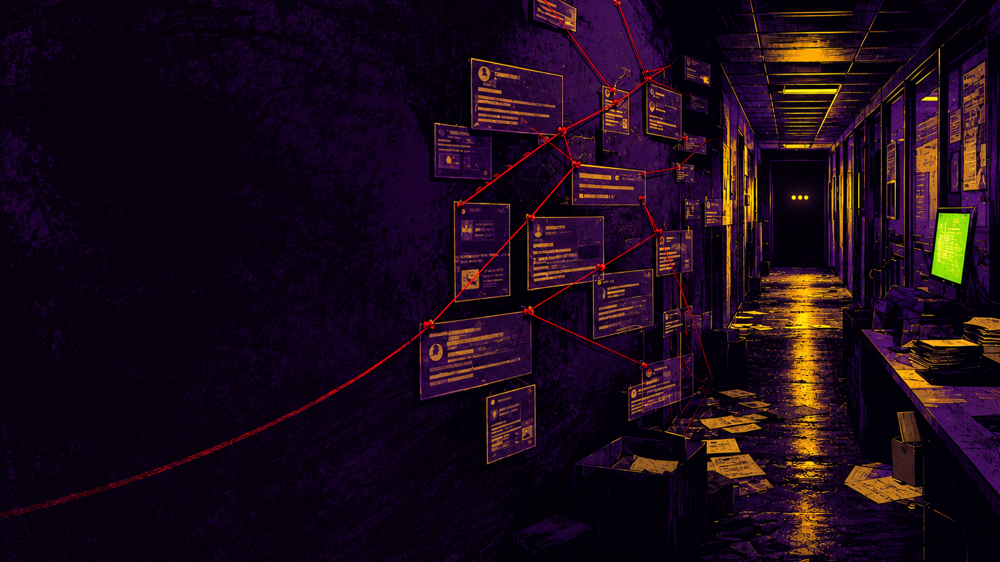

# DontGhostMe

**A candidate-owned recruiter relationship tracker that reconstructs job-search history from email.**

Recruiters appear, disappear, follow up, submit candidates without clear status, and move between companies. DontGhostMe is intended to turn that scattered communication history into a private, correctable record of recruiters, opportunities, submissions, replies, follow-ups, and unresolved outcomes.

## Status

DontGhostMe is in discovery and pre-scaffold planning. The repository currently contains the product definition, research record, privacy boundaries, and phased roadmap that coding agents must follow before choosing a stack or generating the application.

## Core boundaries

- Candidate-owned and evidence-based.
- Gmail observation is strictly read-only; no sending, drafting, editing, labeling, archiving, trashing, or deleting.
- The first proof of concept should process a local Google Takeout export using synthetic data during development.
- No LinkedIn scraping, hidden APIs, session-cookie access, or page automation.
- Machine-extracted facts retain source provenance, confidence, and user-correction workflows.
- Real mailbox archives, messages, tokens, and recruiter records must never enter this public repository.

## Start here

Coding agents and contributors should read these documents in order:

1. [`AGENTS.md`](./AGENTS.md) — agent entry point and non-negotiable rules.
2. [`CLAUDE.md`](./CLAUDE.md) — authoritative architecture and product context.
3. [`docs/PRODUCT_BRIEF.md`](./docs/PRODUCT_BRIEF.md) — user problem, product model, and initial experience.
4. [`ROADMAP.md`](./ROADMAP.md) — phased implementation sequence and exit criteria.
5. [`docs/research/product-landscape.md`](./docs/research/product-landscape.md) — researched products, APIs, policies, and integration options.

## Initial development target

The first scaffold should establish a local development environment, domain contracts, tests, and an accessible application shell populated only with synthetic recruiter and opportunity data. Live Gmail, LinkedIn, AI, enrichment, verification, analytics, and outbound communication are explicitly outside the initial scaffold.

## License

DontGhostMe is licensed under the [GNU Affero General Public License v3.0](./LICENSE).
