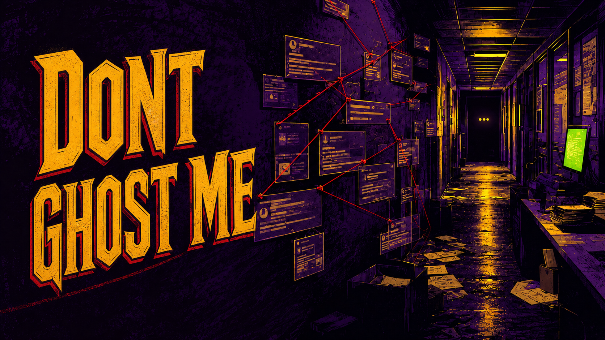

# DontGhostMe



**A candidate-owned recruiter relationship tracker that reconstructs job-search history from email.**

Recruiters appear, disappear, follow up, submit candidates without clear status, and move between companies. DontGhostMe is intended to turn that scattered communication history into a private, correctable record of recruiters, opportunities, submissions, replies, follow-ups, and unresolved outcomes.

## Status

M1 safe historical import and M2 local recruiter/opportunity discovery are implemented with synthetic fixtures. M2 requires confirmed candidate-owned email addresses, produces explainable proposals, and promotes only reviewed facts.

## Core boundaries

- Candidate-owned and evidence-based.
- Gmail observation is strictly read-only; no sending, drafting, editing, labeling, archiving, trashing, or deleting.
- The first proof of concept should process a local Google Takeout export using synthetic data during development.
- No LinkedIn scraping, hidden APIs, session-cookie access, or page automation.
- Machine-extracted facts retain source provenance, confidence, and user-correction workflows.
- Real mailbox archives, messages, tokens, and recruiter records must never enter this public repository.

## Start here

Coding agents and contributors should read these documents in order:

1. [`AGENTS.md`](./AGENTS.md) — agent entry point and non-negotiable rules.
2. [`CLAUDE.md`](./CLAUDE.md) — authoritative architecture and product context.
3. [`docs/PRODUCT_BRIEF.md`](./docs/PRODUCT_BRIEF.md) — user problem, product model, and initial experience.
4. [`ROADMAP.md`](./ROADMAP.md) — phased implementation sequence and exit criteria.
5. [`docs/research/product-landscape.md`](./docs/research/product-landscape.md) — researched products, APIs, policies, and integration options.

## Current development target

The M1 foundation adds bounded local MBOX staging, preview, worker-isolated MIME parsing, inert text normalization, resumable checkpoints, deduplication, redacted errors, import history, and cleanup. M2 classifies those normalized messages with versioned local rules after the candidate confirms their mailbox addresses. Results remain proposals until reviewed; identity links, company changes, grouping, and submissions always require confirmation. Live Gmail, LinkedIn, AI, enrichment, verification, analytics, and outbound communication remain explicitly excluded.

## License

DontGhostMe is licensed under the [GNU Affero General Public License v3.0](./LICENSE).

## M0 local development

M0 is a synthetic vertical slice. It does not connect to Gmail, LinkedIn, AI services, analytics, telemetry, or any other network service. Do not place real messages or personal data in this repository.

### Prerequisites

- Bun `1.4.0`
- Node.js `24.20.0` (primary) or `26.4.0` (compatibility)
- A local filesystem for the SQLite database

### Setup

```bash
bun install --frozen-lockfile
bun run db:migrate
bun run db:seed
bun run dev
```

Open `http://127.0.0.1:3000`. Re-running `db:seed` safely replays the same nine-message fixture without duplicates. Use **Imports** to preview and process an extracted local `.mbox`; this never changes Gmail.

### Verification and database operations

```bash
bun run check
bun run typecheck
bun run test
bun run build
bun run test:e2e
bun run db:backup
```

The database and timestamped backups live in ignored local folders. The backup command checks that the synthetic copy opens cleanly, passes SQLite integrity and foreign-key checks, and contains representative rows. It does not prove disaster recovery for real data.

See [`DESIGN.md`](./DESIGN.md) for the interface contract and [`ADR 0001`](./docs/adr/0001-m0-runtime-and-storage.md) for runtime, storage, migration, and PostgreSQL decisions.
